# Glassmorphism：新潮UI风格简明教程

<u>2022/10/30</u>


## 0x00 | 简介

​	玻璃态(Glassmorphism)是一种19-21年左右兴盛的UI/UX设计风格，最早在2013年ios7中被广泛引入。其背后的主要设计特征是略微透明的磨砂玻璃外观，使模糊的看到背景是什么，但是又不能准确的分辨出背景的细节。这样的效果能够分离不那么重要的彩色的背景，和该页面主要要呈现的主体，在主体平面上给人平滑感与精致感，空灵优雅

​	在Google上直接搜索'Glassmorphism'就能搜索到很多尤其是网页设计上的玻璃态风格

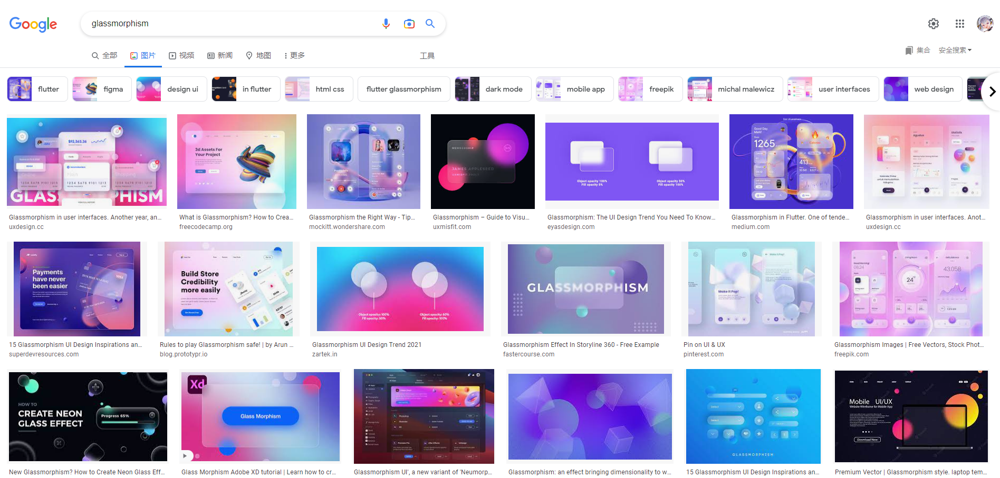


## 0x01 | 玻璃态的核心要素

如何构建一个以玻璃态风格为主的页面？

### 核心代码

核心代码如下：

```css
/* 纯白背景 + 高透明度 */
background: rgba(255, 255, 255, 0.05);
/* 对元素的背景进行模糊处理 */
backdrop-filter: blur(15px);
/* 对平板的左和上边界明亮处理，模拟光源从左上来，类似反光的效果，增加平板的立体感 */
border-top: 1px solid rgba(255, 255, 255, 0.2);
border-left: 1px solid rgba(255, 255, 255, 0.2);
/* 平板黑色影子效果，也是增加立体感 */ 
box-shadow: 5px 5px 30px rgba(0, 0, 0, 0.2);
```

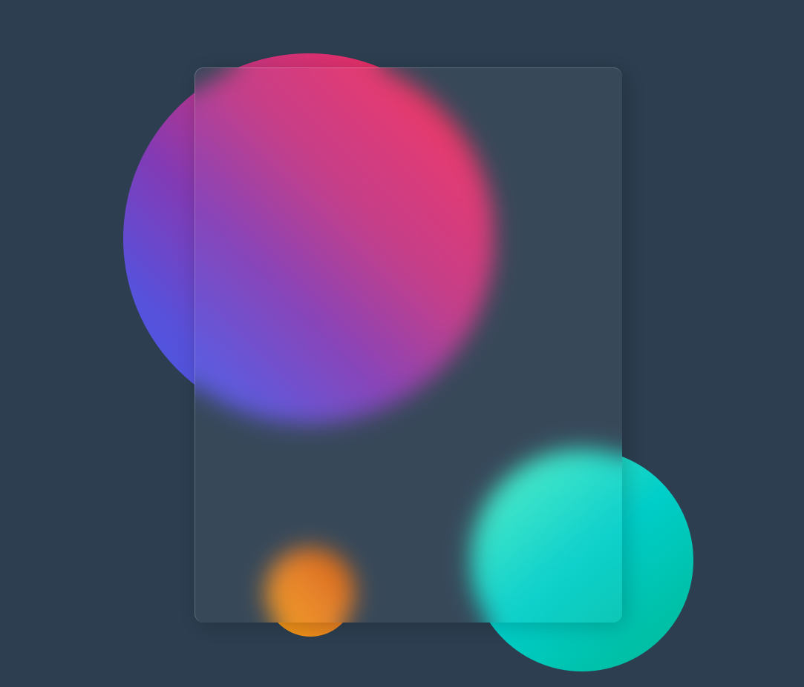

​	上述背景和背景模糊还有边框的代码是玻璃态平板的核心，但是效果不唯一，可以在这些代码基础上各种魔改，加入你自己想要做的效果

​	接下来我们看看如何在玻璃平板上叠加玻璃平板

### 玻璃平板的叠加

​	这是叠加了第二层的玻璃平板叠层

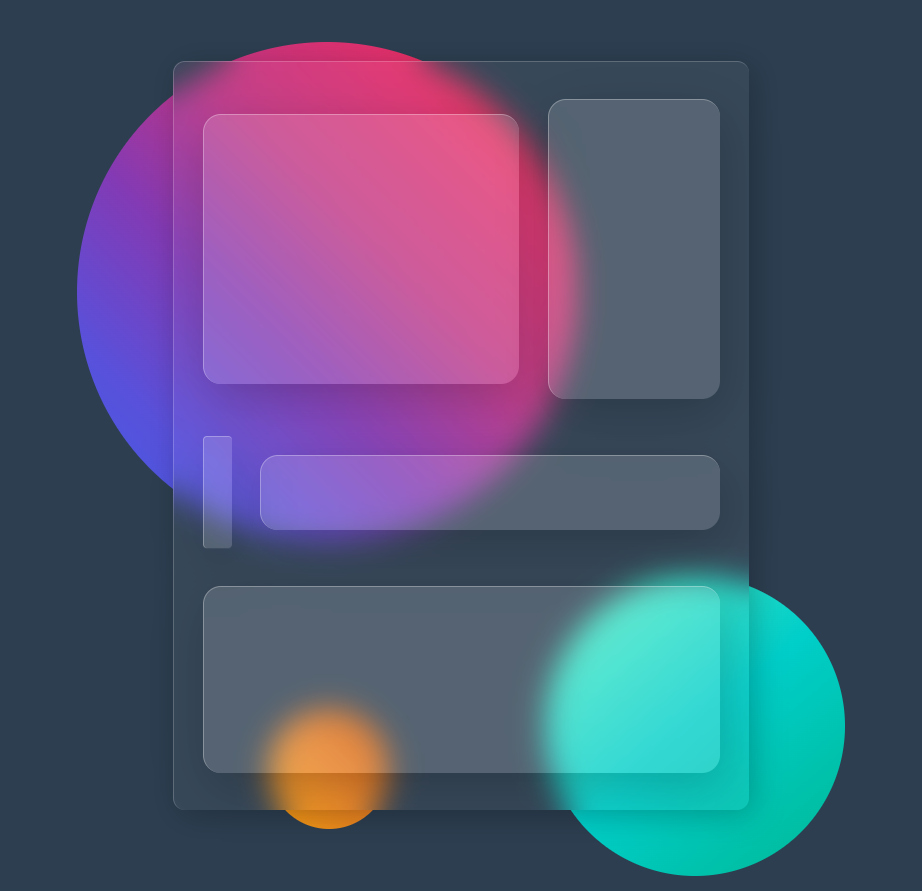

​	这是叠加了第三层的玻璃平板叠层

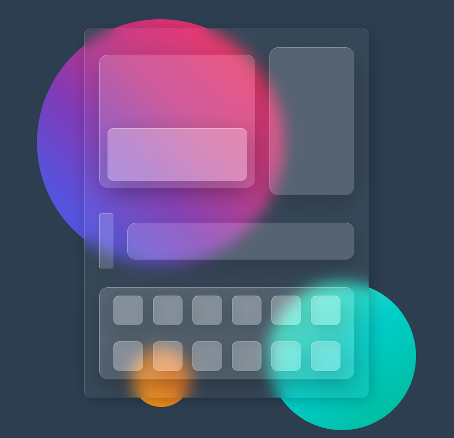

​	一般来说层数越高，这个平板层的背景会设置的越白，例如本例是这样设置的

```css
/* 第一层 */
background: rgba(255, 255, 255, 0.05);
/* 第二层 */
background: rgba(255, 255, 255, 0.1);
/* 第三层 */
background: rgba(255, 255, 255, 0.2);
```

​	这里透明度在不断降低，即白底的背景慢慢体现的更多了，所以直观上会越来越白

​	但是在设计上不推荐叠加的层数过高，一般三四层最多，否则透明度降低太多就失去玻璃态的原本意义了


## 0x02 | 背景衬托很重要

​	接下来，有一点值得注意：玻璃态的成功体现，其背景衬托很重要

​	以下例子我们随便设计一个背景，比如这个彩色圆形旋转一周作为背景

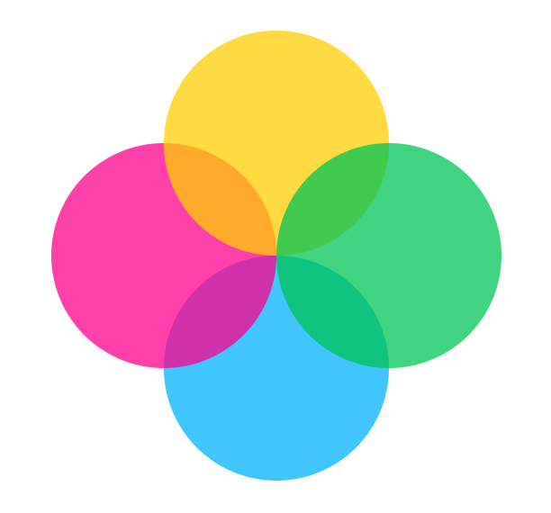

​	我们加上模糊效果，再在前面放上之前所说的玻璃平板，就能凸显出玻璃态的效果

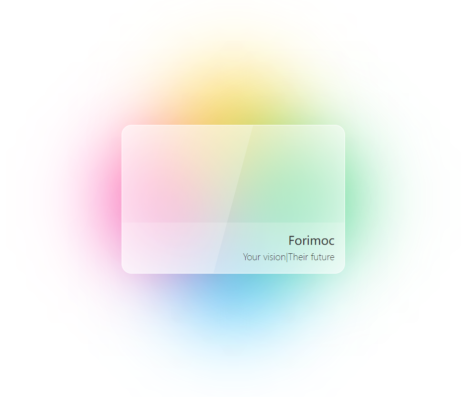

​	如果没有背景的衬托，玻璃态就没意义了，如下图

​	因为玻璃平板本体并不是引人注目的元素，而是与彩色模糊背景组合后的玻璃态才是

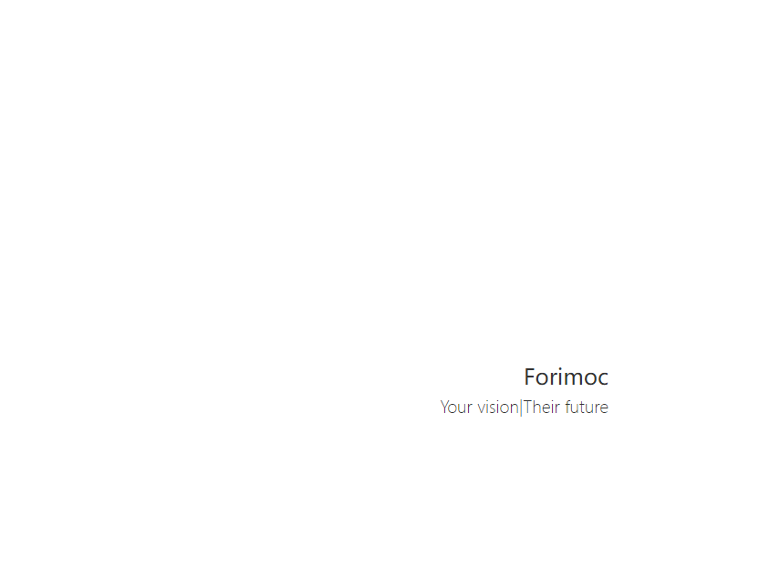


## 0x03 | 为玻璃态选择背景

​	那么如何为玻璃态选择合适的背景呢？

​	我们先来看一下不合适的背景是什么

### 不合适的背景

1. 没有背景（比如0x02中的例子）或过于亮色的背景
2. 纯色的单调背景

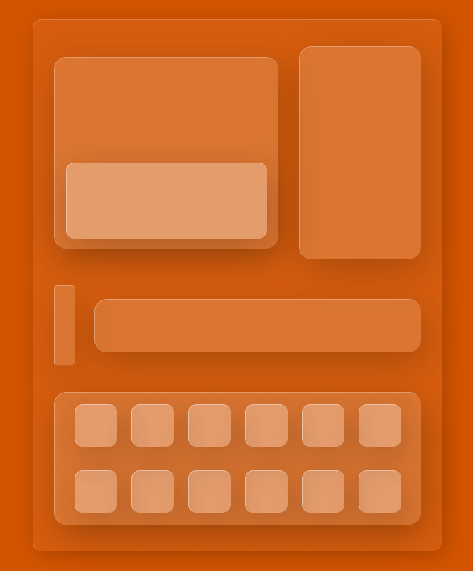


### 优秀的背景

#### 轻度模糊的炫光背景

- 玻璃板后的炫光字体：仅仅是炫光字体作为背景

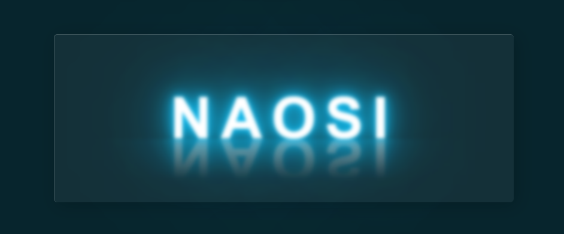

- 炫光玻璃态按钮：这里是以色块为炫光背景

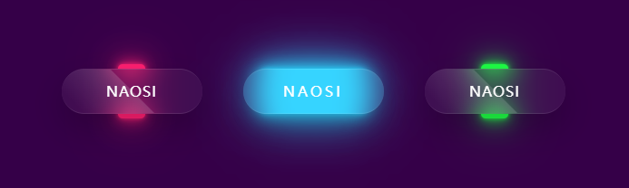

- 炫光玻璃态博客卡片：用上前面的玻璃态卡片，改装一个博客界面，背后是模糊字体+淡色炫光色块背景

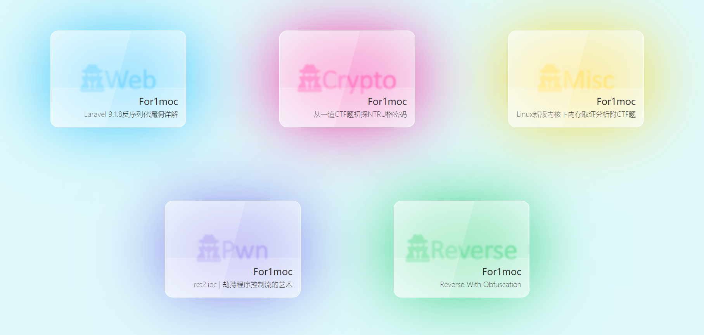

#### 线性渐变色差的大背景

​	线性渐变(Linear Gradient)色差的大背景指的是在背景上应用渐变色

​	一般来说这种背景的渐变最少从一个色系渐变到相邻的色系，比如下图从紫色（#333399）渐变到粉红（#ff00cc）。

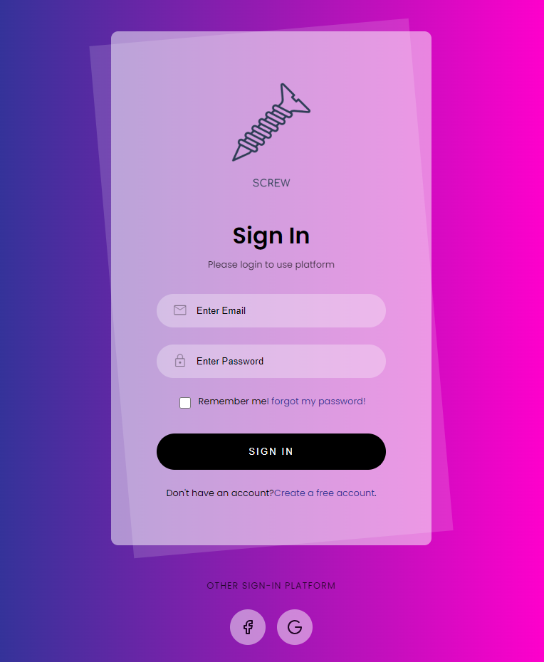

​	但是跨越180度的色系渐变也不是完全不合适，比如下图个人简介的例子，这个例子里使用的是基于低多边形(Low Poly)轮廓的渐变色差背景，从背景中看得出来，从左下角到右上角大约由玫瑰红（#e84393）渐变到天蓝深蓝（#0984e3），在色系图里几乎完全是对立的色系

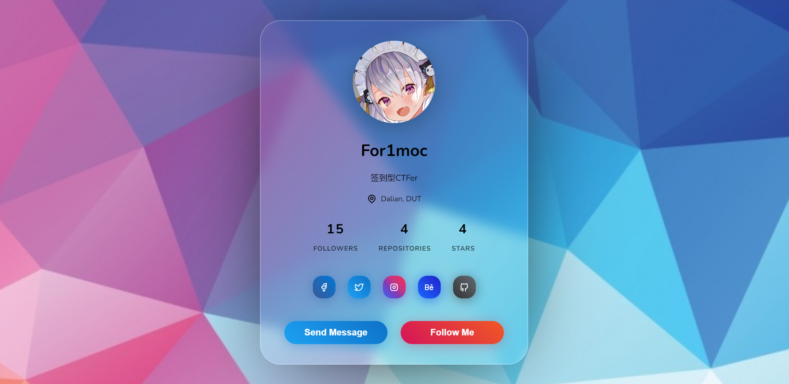

> 关于低多边形背景，在谷歌搜索'low poly bg'就能检索到大量相关结果
>
> 低多边形维基百科：https://zh.wikipedia.org/zh-cn/%E4%BD%8E%E5%A4%9A%E8%BE%B9%E5%BD%A2


## 0x04 | 其他资源

### 关于Glassmorphism的介绍内容

#### 文章

https://uxdesign.cc/glassmorphism-in-user-interfaces-1f39bb1308c9

超过20年设计经验的设计师Michal Malewicz对Glassmorphism的独家解读，Nov 23，2020

#### 视频

https://www.youtube.com/watch?v=BGtkqPrjkos

视频共13分钟，简明的解释了以下内容：

- Where is this coming from
- What does it look like
- How to make it


### 实用CSS工具站

#### 平面设计取色

https://flatuicolors.com/

#### fonts/icons

https://fontawesome.com/

https://tabler-icons.io/

https://fonts.google.com/

#### 一系列独特CSS工具

https://bennettfeely.com/

包括制作3D字体、现成纯CSS背景、编辑clip paths、flex布局探索等等